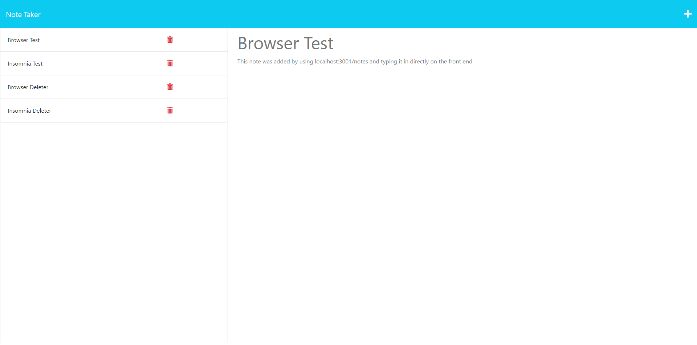

# Note Taker App - John Mabie

[](https://opensource.org/licenses/MIT)
---
### This project is designed to allow a user to save and delete notes using either the front end or Insomnia

#### Here is the link to the GitHub repository: https://github.com/jmabie94/3-2-23-notetakerapp
#### Here is the link to the Heroku deployment: https://peaceful-river-30621.herokuapp.com/
---
## Contents
1. [About](#about)
    1. [User Story](#user%20story)
    2. [Acceptance Criteria](#acceptance%20criteria)
    3. [Media](#media)
2. [Installation](#installation)
3. [License](#license)
4. [Contributing](#contributing)
5. [Tests](#tests)
6. [Authors and Acknowledgments](#authors%20and%20acknowledgments)
---
## About

#### Using Express.js, Heroku and Insomnia, the deployed app allows the User to freely save and delete notes either using the browser (and correlating icons) or using POST and DELETE requests directly through Insomnia, and the application is deployed through Heroku!
---
## User Story

```md
AS A small business owner
I WANT to be able to write and save notes
SO THAT I can organize my thoughts and keep track of tasks I need to complete
```
---
## Acceptance Criteria

```md
GIVEN a note-taking application
WHEN I open the Note Taker
THEN I am presented with a landing page with a link to a notes page
WHEN I click on the link to the notes page
THEN I am presented with a page with existing notes listed in the left-hand column, plus empty fields to enter a new note title and the note’s text in the right-hand column
WHEN I enter a new note title and the note’s text
THEN a Save icon appears in the navigation at the top of the page
WHEN I click on the Save icon
THEN the new note I have entered is saved and appears in the left-hand column with the other existing notes
WHEN I click on an existing note in the list in the left-hand column
THEN that note appears in the right-hand column
WHEN I click on the Write icon in the navigation at the top of the page
THEN I am presented with empty fields to enter a new note title and the note’s text in the right-hand column
```
---

## Media:

Screenshot of the App on the front end:



Screenshot of the Terminal Console Logs and the updated db.json file content:


---

## Installation:

Utilizing the Application is simple!

Either use the deployed version at https://peaceful-river-30621.herokuapp.com/

OR

First, clone the repo:
    
    git clone git@github.com:jmabie94/3-2-23-notetakerapp.git

Next, open an integrated terminal in your cloned folder and do the following:
    
    run npm init -y
    run npm i
    run node server.js

Then, open your browser to PORT 3001 and freely add & delete notes!
    
---

## License
License used for this project - MIT
* For more information on license types, please reference this website for additional licensing information - [https: //choosealicense.com/](https://choosealicense.com/).
---
## Contributing:
To contribute to this application, create a pull request.
Here are the steps needed for doing that:
- Fork the repo
- Create a feature branch (git checkout -b NAME-HERE)
- Commit your new feature (git commit -m 'Add some feature')
- Push your branch (git push)
- Create a new Pull Request
Following a code review, your feature will be merged.
---
## Tests:

### No tests were used
---
## Authors and Acknowledgments:

### Primary Author: Jack Mabie

### Resources Used: Express, UUID, Heroku, Insomnia & Tutoring

---
## Contact Information:
* GitHub Username: jmabie94
* Email: johnmabie94@gmail.com